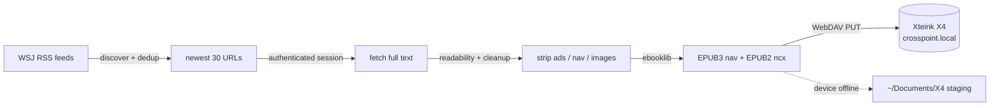

<h1 align="center">WSJ → Xteink X4</h1>

<p align="center">
  <em>Your morning Wall Street Journal, auto-delivered to a credit-card-sized e-reader.</em>
</p>

<p align="center">
  
  
  
  
</p>

---

One command turns the latest WSJ into a clean EPUB and pushes it straight onto a
**Xteink X4** (4.3" e-ink, 480×800, no touch, ESP32-C3, running the open-source
**CrossPoint** firmware):

```bash
python wsj_x4.py        # "Build WSJ for X4"
```

No cables. No paywall bypass. No cookies in the repo.

## Why

The X4 is a lovely little distraction-free reader, but it has no native news app —
and a 4.3" e-ink screen hates the modern web. This builds a **stripped-down,
image-free, section-grouped** newspaper sized for exactly that screen, and drops
it on the device over Wi-Fi while you're making coffee.

## How it works



1. **Discover** article URLs from WSJ RSS feeds — overlapping feeds are
   **deduplicated by canonical URL**, then sorted newest-first (top 30).
2. **Fetch** full text in *your own authenticated WSJ session* — a persistent
   Playwright Chromium profile. It does **not** bypass the paywall.
3. **Clean** each article for e-ink: ads, nav, promos, scripts, and (by default)
   **images** are removed — the X4 chokes on GIF/progressive JPEG and is slow on
   big images. `--images` keeps them.
4. **Build** a valid EPUB with a proper table of contents (EPUB3 `nav` + EPUB2
   `ncx` for CrossPoint), grouped by section.
5. **Deliver** via HTTP **WebDAV `PUT`** to `crosspoint.local/WSJ/`. A
   **seen-cache** means repeat runs never re-deliver the same story.

## Your subscription stays private 🔒

Your WSJ login lives **only** in a Playwright profile on disk at
`~/.config/wsj_x4/chrome-profile/` — outside this repo. Cookies, tokens, and
login state are **never committed**: `.gitignore` blocks profile dirs,
`cookies*.json`, `.env`, and `*.epub`. There is no password stored anywhere — auth
*is* the browser profile.

## Setup (macOS)

```bash
# 1 · virtualenv
python3 -m venv .venv && source .venv/bin/activate

# 2 · dependencies
pip install -r requirements.txt

# 3 · Playwright browser (one-time, ~150 MB)
playwright install chromium

# 4 · log into WSJ once — opens a real browser; 2FA is fine.
#     Sign in, then close the window. The session persists for all later runs.
python wsj_x4.py --login
```

Then, any time:

```bash
python wsj_x4.py
```

> **Session expired?** (everything comes back paywalled) — just run
> `python wsj_x4.py --login` again, or delete `~/.config/wsj_x4/chrome-profile`.

## Delivery / WebDAV

The X4 mounts **read-only** in Finder, so the script never writes to
`/Volumes/crosspoint.local`. It talks WebDAV over HTTP directly:

| step | request |
|------|---------|
| ensure folder | `MKCOL http://crosspoint.local/WSJ/` |
| upload | `PUT http://crosspoint.local/WSJ/WSJ Latest - YYYY-MM-DD-HHMM.epub` |

Before building it checks the device is reachable. If the X4 is **off or off-Wi-Fi**,
the EPUB is left in `~/Documents/X4/` and the run reports it wasn't synced.

Change the target in the config block at the top of [`wsj_x4.py`](wsj_x4.py)
(`X4_WEBDAV_BASE`, `X4_WEBDAV_SUBDIR`).

## Options

| flag | effect |
|------|--------|
| `--limit N` | max articles (default `30`) |
| `--images` | keep images (default: dropped for e-ink) |
| `--include-seen` | don't skip already-delivered articles |
| `--no-sync` | build only; leave the EPUB in local staging |
| `--headed` | show the browser while fetching (use if WSJ blocks headless) |
| `--login` | (re)authenticate WSJ, then exit |

## Feeds

Edit the `FEEDS` list at the top of [`wsj_x4.py`](wsj_x4.py). Dead feeds are
skipped, not fatal. Seeded with verified-working WSJ feeds:

| section | feed |
|---------|------|
| World | `RSSWorldNews.xml` |
| Markets | `RSSMarketsMain.xml` |
| Business | `WSJcomUSBusiness.xml` |
| Technology | `RSSWSJD.xml` |
| Opinion | `RSSOpinion.xml` |

## One-keystroke run

<details>
<summary><b>Raycast</b> — Script Command</summary>

```bash
#!/bin/bash
# @raycast.title Build WSJ for X4
# @raycast.mode fullOutput
cd /Users/malpern/local-code/x4-pipeline && ./.venv/bin/python wsj_x4.py
```
</details>

<details>
<summary><b>Keyboard Maestro</b> — Execute Shell Script action</summary>

```bash
cd /Users/malpern/local-code/x4-pipeline && ./.venv/bin/python wsj_x4.py
```
</details>

## Sample run

```text
== Build WSJ for X4 ==
1. Discovering articles from RSS...
   + World: 14 unique so far
   + Markets: 22 unique so far
   ...
2. Fetching 30 articles in your WSJ session...
   [1/30] ok   Markets Wobble as Traders Weigh Rate Path
   [2/30] SKIP  Live Q&A: Ask Our Columnists  (paywalled / insufficient text)
   ...
3. Building EPUB (28 articles)...
4. Delivering to device over WebDAV...

===== Report =====
Included: 28 articles
    World: 9
    Markets: 11
    Business: 5
    Technology: 3
Skipped: 2
Sync: delivered to device
Output: http://crosspoint.local/WSJ/WSJ Latest - 2026-06-27-0712.epub
```

## A note on terms

This reads paywalled content **you pay for**, for personal offline reading on your
own device — it does not bypass the paywall. Automated extraction is nonetheless a
gray area under WSJ's terms of service. Personal use only.
