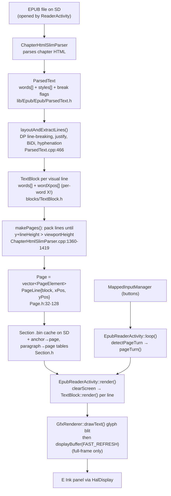
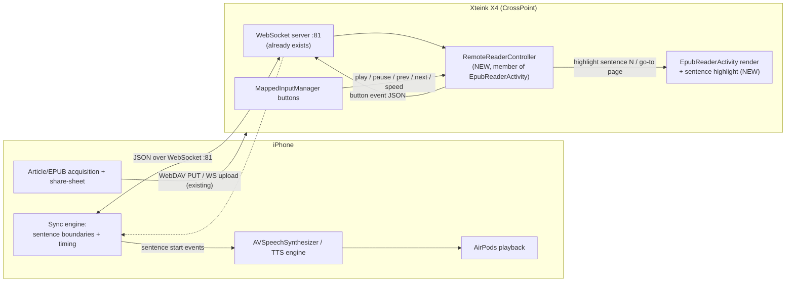

# Feasibility Study: Remote TTS Synchronization for CrossPoint Reader on the Xteink X4

**Date:** 2026-06-27
**Subject:** Can CrossPoint Reader be extended so an iPhone drives a synchronized
reading experience — phone does TTS / AirPods / playback / sync; the X4 is a
synchronized E Ink display that highlights the spoken sentence and forwards
button presses?
**Method:** Direct inspection of the CrossPoint Reader firmware source
(`github.com/crosspoint-reader/crosspoint-reader`, version `1.4.1`,
`platformio.ini:[crosspoint] version = 1.4.1`). All file/line citations below
refer to that tree.

---

## 0. TL;DR

The proposed split — **iPhone = brain, X4 = synchronized display + remote** —
is a *good* architectural fit for the X4's weak single-core ESP32-C3, and most
of the needed plumbing already exists in some form:

| Capability | Already in firmware? | Where |
| --- | --- | --- |
| HTTP server + JSON | ✅ Production-grade | `src/network/CrossPointWebServer.*`, ArduinoJson 7.4.2 |
| WebSocket server | ✅ Present & used (uploads only) | `links2004/WebSockets 2.7.3`, port 81 |
| Remote reading-state sync (analog) | ✅ KOReader sync | `lib/KOReaderSync/*` |
| Stable position addressing | ✅ XPath + spine/page + anchors | `lib/KOReaderSync/ProgressMapper`, `Section.h` |
| Per-word on-screen X coordinates | ✅ Retained after layout | `TextBlock::wordXpos` |
| Filled-rectangle / inverted draw | ✅ Primitives exist | `GfxRenderer::fillRect`, `drawText(...,black)` |
| Background render task (FreeRTOS) | ✅ | `ActivityManager` render task |
| Automatic page advance | ✅ Already a feature | `EpubReaderActivity` auto page-turn |
| Clean per-screen extension model | ✅ Activity + lifecycle hooks | `src/activities/Activity.h` |

**But there are three hard obstacles, in order of severity:**

1. **🚩 Scope conflict (non-technical, decisive for upstreaming).** `SCOPE.md`
   explicitly lists **"Active Connectivity … No … Background Wi-Fi tasks drain
   the battery and complicate the single-core CPU's execution"** and **"Media
   Playback: No Audio players or Audio-books"** as *Out-of-Scope*. The proposal
   keeps *audio* off-device, which sidesteps the letter of the media rule, but
   **"maintain a live Wi-Fi/WebSocket connection while reading"** is squarely
   what the Active-Connectivity rule forbids. This must be resolved in a
   GitHub Discussion *before* any code, or the feature lives as a fork.

2. **Networking and reading are currently mutually exclusive.** Wi-Fi only comes
   up inside `CrossPointWebServerActivity`, and that activity calls
   `WiFi.disconnect()` + a silent reboot on exit. There is no "Wi-Fi while
   reading" path today. Adding one is the single largest piece of work.

3. **No partial e-ink refresh.** The display only refreshes the *whole* frame
   (`displayWindow()` is commented out as experimental at `GfxRenderer.h:138`).
   Every sentence-highlight change therefore costs a full-screen refresh
   (~fast-refresh waveform). This bounds the achievable highlight cadence and is
   the main UX risk for "smooth" sentence tracking.

Net: **Technically very feasible as a fork / opt-in build; uphill as an upstream
contribution without a scope decision.** Sentence-level (not word-level)
sync — which the brief already chose — is the right call and keeps the refresh
budget realistic.

---

## A. Current Rendering Pipeline (as-built)



**Key facts that make or break the feature:**

- **Layout → coordinate mapping is *forward only and partially retained.*** After
  pagination, each `TextBlock` keeps **`std::vector<int16_t> wordXpos`** — the
  per-word X offset on its line (`lib/Epub/Epub/blocks/TextBlock.h`), and the
  owning `PageLine` keeps `yPos`/`xPos` (`lib/Epub/Epub/Page.h:32-43`). So a
  *word index → on-screen rectangle* is reconstructable
  (`x = pageLine.xPos + wordXpos[i]`, `y = pageLine.yPos`,
  `w = renderer.getTextWidth(...)`, `h = renderer.getLineHeight()`). **Glyphs
  themselves are blitted and discarded** (`TextBlock::render`,
  `blocks/TextBlock.cpp:10-74`) — there is no glyph-box buffer, but we don't
  need one for sentence highlighting.
- **No sentence boundaries are tracked** anywhere in layout. Word boundaries are
  implicit in the `words[]` vectors; sentences are not.
- **No character-offset → source mapping** survives layout for EPUB. (TXT keeps
  byte offsets, but EPUB does not.)
- **Position model:** `SavedPosition{spineIndex, pageNumber}`
  (`src/activities/reader/EpubReaderActivity.h:51`); persistent bookmarks use an
  **XPath-like progress string + percentage** (`src/BookmarkEntry.h`); jumps by
  HTML anchor and by synthetic paragraph index are supported via
  `Section::getPageForAnchor()` / `getPageForParagraphIndex()` (`Section.h`).
- **Pagination is deterministic and cached** per chapter (the `.bin` Section
  cache), so the phone and the X4 can agree on a stable addressing scheme.

---

## B. Proposed Architecture (iPhone ↔ CrossPoint)

Keep the X4 a **thin synchronized display**. The phone owns everything stateful.



**Message sketch (JSON over the existing WebSocket on port 81):**

Phone → X4
```json
{ "cmd": "open",      "book": "/WSJ/2026-06-27.epub" }
{ "cmd": "highlight", "loc": { "spine": 4, "page": 12, "sentence": 3 } }
{ "cmd": "goto",      "loc": { "spine": 4, "page": 12 } }
{ "cmd": "state",     "playing": true, "rate": 1.0 }
```

X4 → phone
```json
{ "evt": "button", "action": "play" }
{ "evt": "button", "action": "next_sentence" }
{ "evt": "ready",  "book": "/WSJ/2026-06-27.epub", "spine": 4, "page": 12 }
```

The **sentence address** is the crux. Two viable schemes, both buildable on
existing infrastructure:

- **Option 1 — phone-authoritative sentence index (recommended for v1).** The
  phone segments the article into sentences (it already has the full text for
  TTS). It addresses by `(spineIndex, paragraphIndex, sentenceOrdinal)`. The X4
  maps `paragraphIndex → page` via the existing
  `Section::getPageForParagraphIndex()` table, then locates the sentence's words
  on that page (see §2) to draw the highlight. This requires the X4 to identify
  sentence boundaries *within a paragraph at render time* (cheap: scan the laid-
  out words for `. ! ?` terminators).
- **Option 2 — XPath/CFI like KOReaderSync.** Reuse `ProgressMapper`
  (`lib/KOReaderSync/`) so both sides speak the same XPath-ish progress string.
  More robust, more work. Defer to v2.

---

## Answers to the Seven Research Questions

### 1. Rendering Architecture
- **Layout / pagination:** `ChapterHtmlSlimParser::makePages()`
  (`lib/Epub/Epub/parsers/ChapterHtmlSlimParser.cpp:1360-1419`) drives
  `ParsedText::layoutAndExtractLines()` (`lib/Epub/Epub/ParsedText.cpp:466-534`,
  DP line-breaking at `:547-660`, per-line extraction at `:825-1184`).
- **Objects:** book = `Epub`; chapter/spine item = `Section` (`Section.h`);
  paragraph/run pre-layout = `ParsedText` (`ParsedText.h`); laid-out line =
  `TextBlock` with `words[]` + **`wordXpos[]`** (`blocks/TextBlock.h`); page =
  `Page` → `PageLine{block,xPos,yPos}` (`Page.h:32-128`). There is **no glyph
  object** and **no sentence object**.
- **Mapping retained after pagination?** **Partly — and enough.** Per-word X
  offsets (`wordXpos`) and per-line Y (`PageLine::yPos`) are retained; glyph
  rects are not. Word index → screen rectangle is reconstructable; character
  offset → source text is **not** retained for EPUB.

### 2. Highlighting
- **Can a sentence be highlighted without re-paginating?** **Yes.** Highlighting
  is a draw-time concern only; it does not touch layout. You draw a filled/
  inverted rectangle behind the sentence's word rects, then redraw those words in
  inverted color.
- **Existing highlight code:** the *only* example is footnote-list selection,
  which inverts a whole line: `renderer.fillRect(0, y, screenWidth, lineHeight,
  true)` then `drawText(..., !isSelected)`
  (`src/activities/reader/EpubReaderFootnotesActivity.cpp:~96-104`). No
  selection, annotation, search-highlight, or hyperlink-highlight exists in the
  page renderer. Focus-reading bold-prefix (`blocks/TextBlock.cpp:10-74`) is the
  only in-text emphasis.
- **Primitives available:** `GfxRenderer::fillRect(x,y,w,h,state)`,
  `drawRect(...)`, `invertScreen()` (full-frame only), `drawText(...,bool
  black,...)`, `getTextWidth(...)`, `getLineHeight(...)` (all in
  `lib/GfxRenderer/GfxRenderer.h`). Byte-aligned fast fill at
  `GfxRenderer.cpp:717-788`.
- **Refresh:** **full-frame only.** `displayBuffer(refreshMode)` refreshes the
  whole panel; `displayWindow()` is commented out (`GfxRenderer.h:138-139`). A
  region *cache* exists (`copyRegionToBuffer`/`copyBufferToRegion`,
  `GfxRenderer.h:267-269`) but does **not** drive a partial panel update.
- **Smallest change to highlight one sentence:** in `TextBlock::render()` (or a
  thin wrapper invoked by `EpubReaderActivity::render()`), given the highlighted
  word range `[w0,w1]`: compute the union rect from `wordXpos[]` + line height,
  call `fillRect(rect, true)`, then draw those words with `black=false`. ~40–60
  additive lines, no existing code path broken. Trigger one `displayBuffer(
  FAST_REFRESH)`.

### 3. Sentence Identification
- The renderer does **not** know sentence boundaries. Word boundaries are
  implicit.
- **Difficulty to add:** **Low for "good enough", as a render-time scan.** Since
  per-paragraph word arrays exist, detecting sentence ends by punctuation
  (`. ! ? …` plus quote/paren handling) at render time is straightforward and
  needs no layout change. Preserving *exact* sentence metadata through the
  `.bin` Section cache (so the phone and device agree byte-for-byte) is more
  work and only needed if you want device-authoritative addressing — avoid it
  for v1 by making the **phone authoritative** (Option 1 above).

### 4. Remote Control
- **HTTP server:** `CrossPointWebServer` (`src/network/CrossPointWebServer.*`),
  ESP32 `WebServer` on port 80, routes registered in `begin()` (~`:134-176`):
  files/upload/download/delete/rename/move, settings, fonts, OPDS, Wi-Fi,
  `/api/status`, plus a `WebDAVHandler` and UDP discovery on 8134.
- **WebSocket:** `links2004/WebSockets` `WebSocketsServer` on **port 81**,
  `onEvent(wsEventCallback)` (`CrossPointWebServer.cpp:~189-195`, handler
  `~:1537-1709`). **Already used** for binary file upload with a text command
  framing (`START:<file>:<size>:<path>` → binary chunks → `PROGRESS`/`DONE`).
  This is exactly the shape a Remote Reader API needs.
- **JSON:** ArduinoJson 7.4.2 throughout (`deserializeJson`/`serializeJson`).
- **Closest existing analog:** **KOReaderSync** (`lib/KOReaderSync/*`) —
  authenticates, `GET/PUT /syncs/progress`, syncs an XPath progress string +
  percentage for a document hash. This is "remote reading-state sync" already
  shipping; `ProgressMapper` + `KOReaderDocumentId` are reusable for a shared
  addressing scheme.
- **Verdict:** the networking layer *can* support a lightweight Remote Reader
  API with modest additions — mainly a command dispatcher on the WS text
  channel (today it only parses `START:`).

### 5. Button Handling
- **Input stack:** `HalGPIO` (7 physical buttons: Back/Confirm/Left/Right/Up/
  Down/Power, `lib/hal/HalGPIO.h`) → `MappedInputManager` (logical buttons +
  orientation-aware remap, `src/MappedInputManager.*`) → polled in
  `EpubReaderActivity::loop()` (`src/activities/reader/EpubReaderActivity.cpp`,
  page-turn via `ReaderUtils::detectPageTurn()`).
- **Intercepting Play and forwarding events:** **Easy.** All reader button logic
  is localized in one `loop()`. Add a branch (e.g. a chosen button/long-press)
  that, instead of mutating local state, hands the event to a
  `RemoteReaderController` which emits a WS event. Existing page navigation is
  untouched if you reuse an unused combo or a new setting.

### 6. Background Tasks
- **MCU:** single-core ESP32-C3.
- **Model:** Arduino `loop()` superloop (`src/main.cpp:483-609`) that polls input
  and yields/`delay(10–50ms)` each iteration, **plus a dedicated FreeRTOS render
  task** created in `ActivityManager::begin()` (`xTaskCreate`,
  `src/activities/ActivityManager.cpp:22-30`) signalled via task notifications,
  guarded by a `RenderLock` mutex.
- **Wi-Fi today:** brought up only inside `CrossPointWebServerActivity`; on exit
  it `WiFi.disconnect()`s and silently reboots. Activities are mutually
  exclusive, and the device deep-sleeps on idle (`enterDeepSleep`,
  `main.cpp:237-270`, full chip reset on wake).
- **Practical to keep a WebSocket alive while reading?** **Yes, but it's the
  central new work.** Three things must change inside the reader path: (a) bring
  Wi-Fi up in `EpubReaderActivity::onEnter()` (a "remote session" sub-mode), (b)
  override `preventAutoSleep()`/`skipLoopDelay()` (both already exist as virtuals
  on `Activity`) so the reader doesn't deep-sleep mid-session, and (c) poll the
  WS either from `loop()` (cheap, 50–100 ms cadence is fine for sentence sync) or
  a small dedicated task. The superloop's existing yield budget makes polling
  viable without a task. **Battery cost is real** and is precisely the
  SCOPE.md objection — so gate it behind an explicit "Remote session" the user
  starts, not an always-on background service.

### 7. Extension Points
- The cleanest, least-invasive home is a **`RemoteReaderController`** owned by
  `EpubReaderActivity`:
  - construct in `onEnter()` (only when a remote session is requested), destroy
    via `unique_ptr` in `onExit()`;
  - `controller->update()` called once at the top of `EpubReaderActivity::loop()`
    to pump the WS and apply inbound commands (highlight/goto) by calling
    existing methods (`pageTurn()`, anchor/percent jumps, a new
    `highlightSentence()`);
  - button branches forward outbound events through it.
  This confines new logic to the reader activity + one new
  file-pair + a draw helper, matching the existing Activity pattern and avoiding
  scatter. (The `Activity` base already defines `onEnter/onExit/loop/render`,
  `preventAutoSleep`, `skipLoopDelay`, `isReaderActivity` — every hook needed is
  already there: `src/activities/Activity.h`.)

---

## C. Feasibility Assessment

Ratings: **Effort** (S/M/L/XL) · **Risk** · **Confidence** in this assessment.

| Item | Feasibility | Effort | Key dependency / risk | Confidence |
| --- | --- | --- | --- | --- |
| **Sentence highlighting** (draw bg + invert text behind one sentence) | **High** | **S–M** | Primitives exist; needs render-time sentence scan + word-rect union. Full-frame refresh only ⇒ each highlight = one fast refresh. | **High** |
| **Remote control API** (open/goto/highlight/state over WS+JSON) | **High** | **M** | WS server + JSON + KOReaderSync patterns all exist; add a command dispatcher on the WS text channel. | **High** |
| **WebSocket synchronization during reading** (live link while reading) | **Medium** | **L** | Must bring Wi-Fi up inside the reader and suppress deep-sleep — no such path today; battery drain; single-core contention. This is the architectural crux. | **Medium** |
| **Button event forwarding** (play/pause/prev/next/speed → phone) | **High** | **S** | One localized `loop()`; events routed via controller. | **High** |
| **Maintaining sync across page turns** (auto-advance page when audio crosses page boundary) | **Medium-High** | **M** | Pagination deterministic & cached; auto page-turn already a feature; need paragraph/sentence→page mapping (`getPageForParagraphIndex` exists). Refresh latency (~hundreds of ms) means a brief lag at page boundaries. | **Medium** |
| **Upstream acceptance** | **Low** (without scope change) | — | `SCOPE.md` forbids Active Connectivity / background Wi-Fi. Needs a Discussion + maintainer buy-in, or ship as a fork/opt-in build flag. | **High** |

**Cross-cutting risks**
- **No partial refresh** caps highlight smoothness. Mitigation: sentence (not
  word) granularity — already chosen — and accept one fast-refresh per sentence.
  Optionally batch highlight + page content into a single refresh.
- **Wi-Fi + e-ink + TLS heap pressure.** KOReaderSync notes only ~46 KB free
  heap and needs ~55 KB for TLS (`KOReaderSyncClient.cpp`). A plain (LAN, non-
  TLS) WebSocket to the phone avoids the TLS ceiling; keep the remote protocol
  unencrypted on the local link or use a pre-shared lightweight scheme.
- **Battery.** Continuous Wi-Fi is the headline SCOPE objection; make remote
  sessions explicit and time-boxed.

---

## D. Implementation Plan (phased, minimally invasive)

Each phase is independently demoable and reviewable.

### Phase 1 — Sentence highlight primitive (no networking)
- Add a render-time helper that, given `(spineIndex, page, wordRange)` or a
  sentence ordinal within a paragraph, computes the union of word rects from
  `PageLine::yPos` + `TextBlock::wordXpos[]` and draws `fillRect` + inverted
  `drawText`.
- Add a lightweight sentence scanner over a page's words (punctuation-based).
- Temporary trigger: a debug button cycles the highlighted sentence on the
  current page. Validates rendering, refresh feel, and rect math.
- **Touches:** `blocks/TextBlock.*`, `EpubReaderActivity::render()`. ~Small.

### Phase 2 — Remote Reader API over the existing WebSocket
- Add a command dispatcher on the WS text channel (alongside the existing
  `START:` upload handler) for `open` / `goto` / `highlight` / `state`, parsed
  with ArduinoJson; emit `ready` / `button` events back.
- Introduce `RemoteReaderController` (new file pair) owned by
  `EpubReaderActivity`; `update()` pumps inbound commands and calls existing
  navigation + the Phase-1 highlight helper.
- Bring Wi-Fi up as an explicit **"Remote session"** entered from the reader
  menu; override `preventAutoSleep()` while active; tear down cleanly on exit
  (without the network activity's reboot).
- **Touches:** `src/network/CrossPointWebServer.*`, new
  `RemoteReaderController.*`, `EpubReaderActivity.*`. ~Medium.

### Phase 3 — Playback synchronization
- iPhone segments the article, drives TTS, and on each sentence boundary sends
  `highlight {spine,page,sentence}`. X4 maps paragraph→page
  (`getPageForParagraphIndex`), auto-advances the page (reuse the existing
  auto page-turn machinery) when the sentence lands on a later page, and
  highlights.
- Handle page-boundary lag and lost-message recovery (phone re-sends current
  loc on reconnect; `ready` echoes device position).
- **Touches:** `RemoteReaderController`, reader auto-advance path. ~Medium.

### Phase 4 — Physical button integration
- Map Play/Pause/Prev-sentence/Next-sentence/Speed to existing buttons (or a
  reader setting); forward as `button` events; keep normal page navigation when
  no remote session is active.
- **Touches:** `EpubReaderActivity::loop()`, `RemoteReaderController`. ~Small.

### Phase 0 (do first) — Scope Discussion
- Open a GitHub Discussion describing the **audio-off-device, opt-in,
  explicit-session** design and asking whether a *gated* connected-reading mode
  is acceptable, given the SCOPE Active-Connectivity rule. Pre-agree on a build
  flag (e.g. `-DENABLE_REMOTE_READER`) so it ships off by default.

---

## Constraints honored
- **No redesign.** Everything above reuses the Activity model, the existing WS
  server, ArduinoJson, the deterministic Section page cache, and the existing
  auto page-turn — adding one controller + one draw helper + one command
  dispatcher.
- **No on-device TTS, no BT audio, no word-level sync.** Sentence granularity,
  phone-authoritative addressing.
- **Opt-in & gated** to respect battery/single-core concerns and give the best
  chance of an eventual upstream proposal.

## Open questions for the maintainers / next step
1. Is a **gated, explicit, audio-off-device** connected mode acceptable under
   the SCOPE Active-Connectivity rule, or fork-only?
2. Preferred addressing: **phone-authoritative paragraph/sentence ordinals**
   (simplest) vs. reusing **KOReaderSync XPath** (more robust)?
3. Acceptable highlight cadence given full-frame fast-refresh (~hundreds of ms)?
